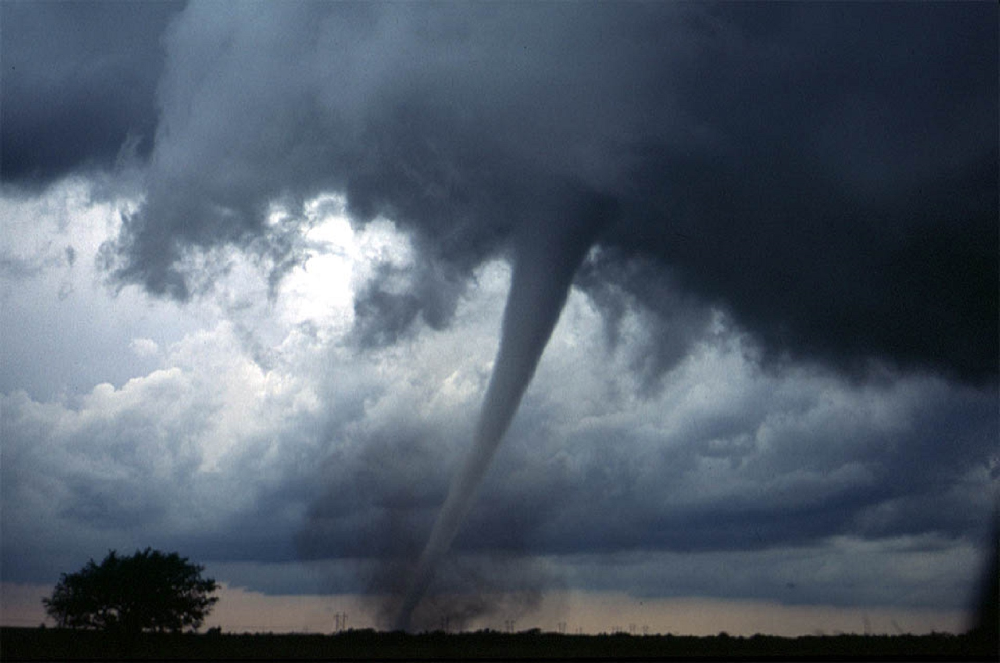

```{r setup, include=FALSE}
knitr::opts_chunk$set(echo = TRUE)
```

The objective of this project is to generate a dataset containing data about 
tornado incidents in the state of Alabama. It includes the incidents' spatial 
and temporal data, tornado characteristics and casualties caused.

```{r tornado, echo=FALSE, out.width = '50%', fig.align = "center"}

```

## Context

The context of this dataset corresponds to tornado incidents in the state of 
Alabama from February 1794 to October 2018.

## Content

The dataset contains data from February 1794 to October 2018 and is a compilation
of different sources that include The Storm Prediction Center (SPC), The National Climatic Data Center (NCDC), Significant Tornadoes by Thomas P Grazulis, Tornadoes in Alabama by Welby Stevens Monthly Weather Review October 1925, and The Birmingham National Weather Service Staff Surveys.

The fields in the dataset are detailed below:

* *Tornado # in Year*: unique identifier for each tornado within a specific year.
* *Year*: year of tornado occurrence.
* *Month*: month of tornado occurence.
* *Day*: day of tornado occurrence.
* *Time (CST)*: hour and minute of tornado occurrence.
* *County*: county where tornado occurred.
* *Damage Scale*: indicator of tornado damage based on the [Fujita Scale](https://www.spc.noaa.gov/efscale/).
* *Maximum Path Width (Yards)*: tornado maximum path width expressed in yards.
* *Path Length (Miles)*: tornado path length expressed in miles.
* *Fatalities*: number of fatalities occurred.
* *Injuries*: number of injuries occurred.
* *Location*: location of the tornado incident.

## Acknowledgement

The data source corresponds to the [Alabama Tornado Occurrences Database](https://www.weather.gov/bmx/tornadodb_main) by NOAA (National Oceanic
and Atmosferic Administration). For questions about the data source contact
Mark Linhares (mark.linhares@noaa.gov).

## Inspiration

The contents of this dataset can be used to aid in severe weather climatology
studies and forecast of tornado events and their strength. This information
can be used by local authorities to preapre for such events and help decrease 
the casualty numbers in future events.

## Licence

This database is distributed under Open Database Licence, individual 
contents under Database Contents Licence, as specified in the LICENCE file.

The main reasons behind such choice are:

* Allows distribution and use of the database for other products.
* Must attribute any work derived from this database.
* Derived works must be offered under the same licence and kept open.


